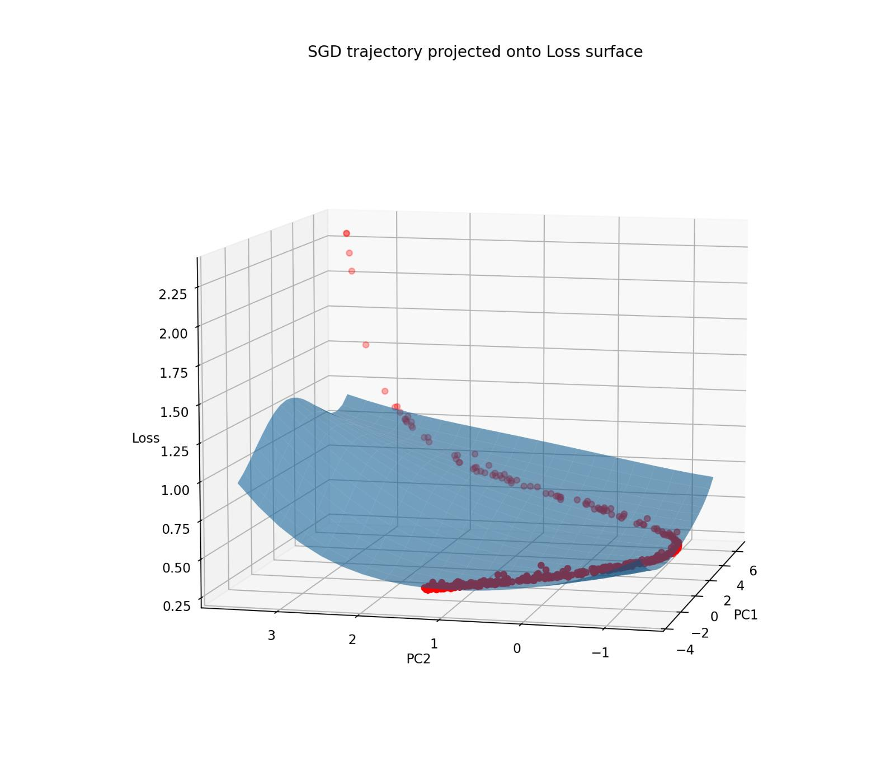
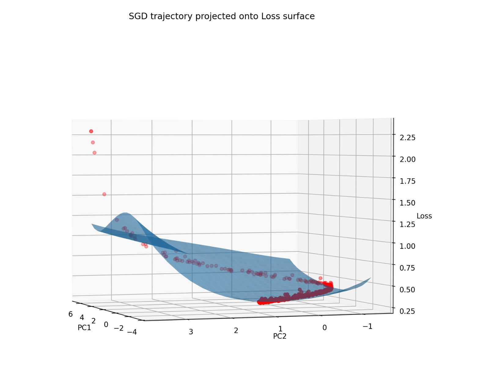

# Image classification using a Deep Neural Network developed from scratch

This repository implements a neural network that classifies fashion items from Fashion MNIST dataset. Forward and backward propogation algorithms are developed from scratch and GRID search was used for selecting the optimal hyperparameters.

Test accuracy of 87.89% was achieved using this network. 

The following graphs shows the SGD trajectory of the cross-entropy loss as a function of weights and biases.

 

 

